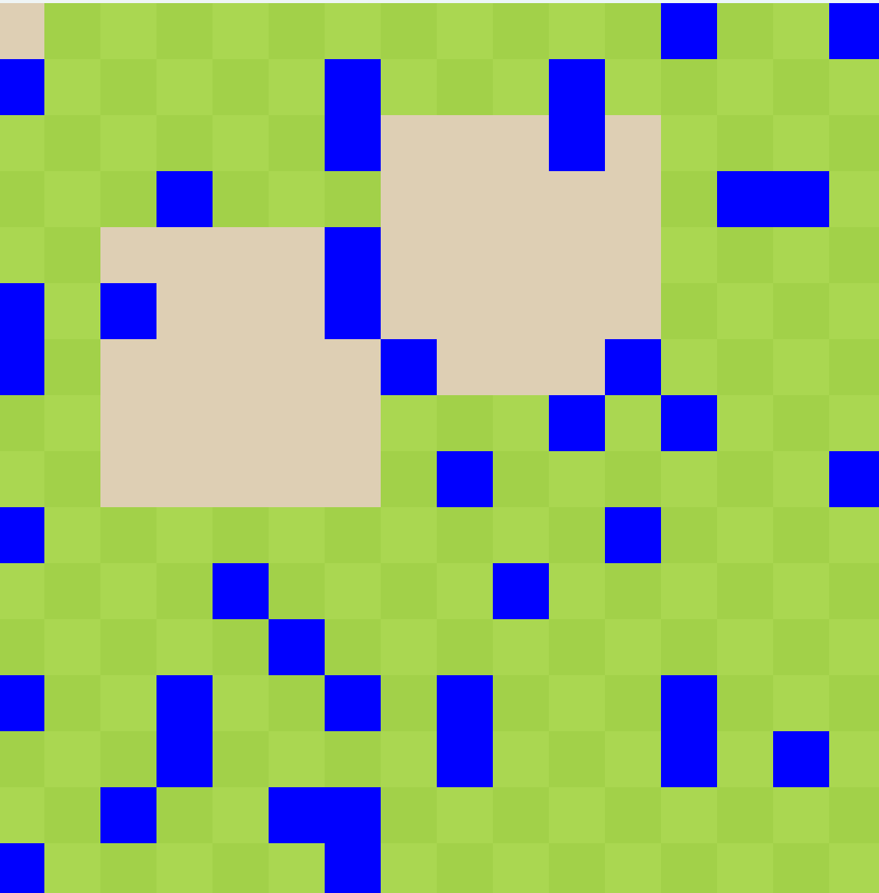

# minesweeper

## What is this?

A minesweeper game written in Java made using JPanel and AWT Graphics! The Panel class is used for pretty much everything - from board rendering to flood fill. Flood fill logic is still in progress, final version should be similar to scan-line flood fills, revealing sections line by line. MouseHandler class observes changes in mouse input and Main.java initializes the frame and starts the game. This was a fun look into graphics and game logic in general, especially the reasoning and use behing flood fills. 

